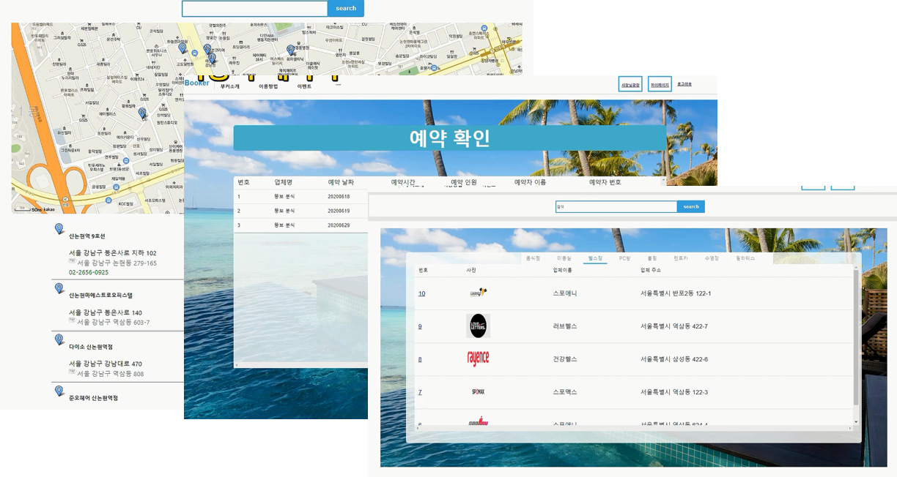
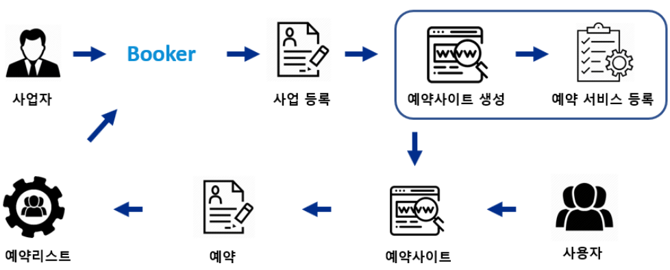
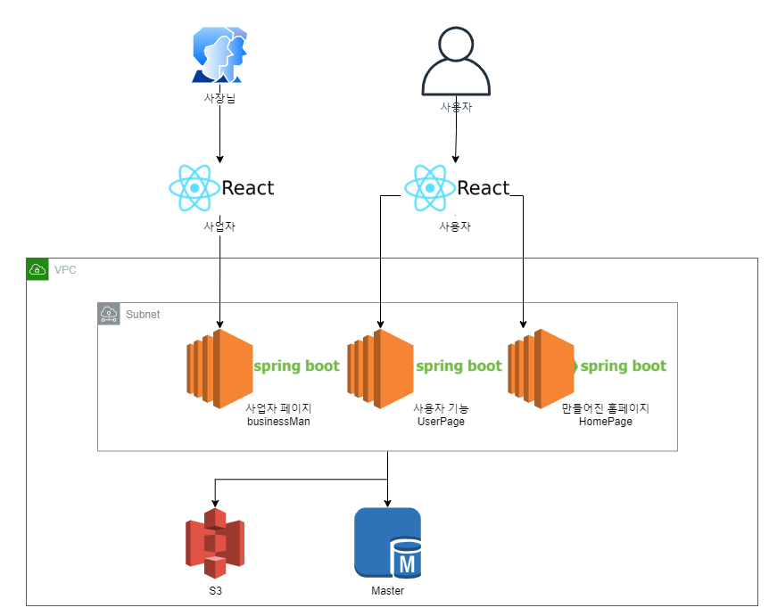

## Booker 개요

성신여대에 위치한 "빙수야" 라는 가게는 아직까지도 수기로 예약을 하는 시스템이었습니다. 이유는 18시부터 예약을 받는 특수한 환경 때문이었습니다. 이런 특이한 예약을 커스텀해주는 서비스가 있으면 어떨까? 하는 생각이 예약서비스 Booker를 만드는 계기가 되었습니다.

 

## 서비스 흐름도

1. Booker를 통해 사업 등록
2. 고객들은 생성된 사이트에서 예약
3. 예약된 리스트로 본인 사업 진행

 

### 아키텍쳐

- 프론트 부분은 리액트로 구현했고, 백엔드는 Spring boot로 구현했습니다. 
- 서버는 기능에 맞게 구분하여 구축하였습니다.
- S3는 이미지 저장소로 활용했습니다.
- RDS에서 모든 테이블을 관장했습니다.

 

## 기능

사용자

- 매장 리스트 조회
- 매장 위치 확인
- 등록된 서비스에 예약
- 내 예약 조회

 

사업자

- 회원가입(DB에 저장)
- 로그인 (로그인 또는 Oauth2를 이용한 구글 로그인)
- 사업등록
- 매장 및 서비스 이미지 업로드
- 서비스 등록
- 예약자 확인(월간, 주간, 일간 명수 제공)

 

### Booerk 시연영상

https://drive.google.com/file/d/1hohiOagCpsQhcqvKEKYK9HDVMc4CQT3M/view?usp=sharing